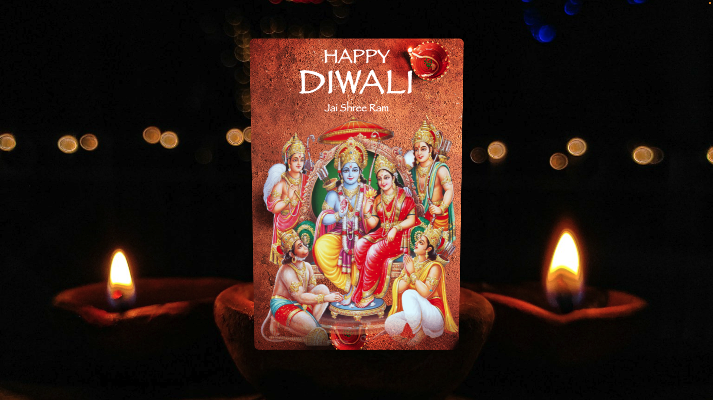

# Happy Diwali | Awesome 3d Card Rotate on Mousemove using HTML CSS JavaScript | Jai Shree Ram

🪔🎇 Happy Diwali to all! 🪔🎇 Celebrate the festival of lights with a special treat from us. In this tutorial, we're bringing you an incredible 3D card rotate effect on mouse movement using HTML, CSS, and JavaScript, all decked out in the spirit of Diwali. 🪔✨

🔥 Get ready to be mesmerized by the magic of web development as we guide you through creating an awe-inspiring 3D card that reacts to your every move.

In this tutorial, you'll explore:
• Implementing HTML structure for the 3D card
• Styling the card to add that extra Diwali sparkle
• Adding interactive functionality with JavaScript
• Creating an immersive 3D effect that will leave your viewers spellbound

Whether you're a seasoned developer or just starting your coding journey, this tutorial will add a dazzling touch to your skill set. By the end, you'll have a stunning 3D Diwali card that will light up your screen and fill your heart with joy.

🚀 Ready to illuminate your coding skills? Click that play button and let the festive coding extravaganza begin! Jai Shree Ram! 🚀

👍 Don't forget to like, share, and subscribe for more inspiring web development tutorials and coding content! Leave your questions and feedback in the comments below. Wishing you all a prosperous and joyous Diwali! 🪔🌟
